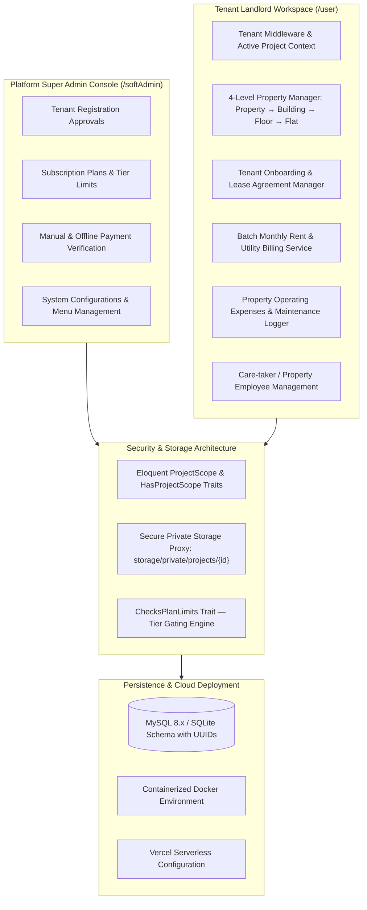
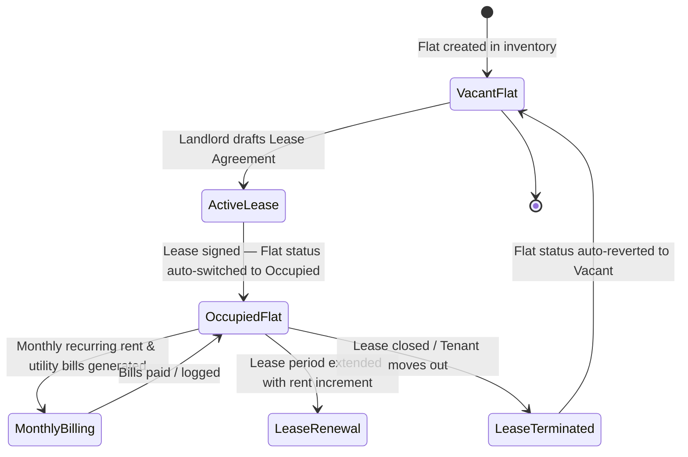
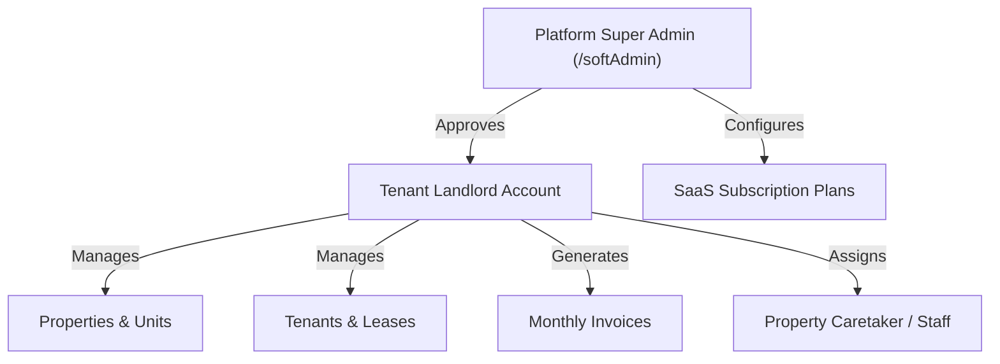

# 🏢 PropEase — Multi-Tenant Real Estate & Property Management SaaS Platform

[](https://laravel.com)
[](https://www.php.net/)
[](https://www.mysql.com/)
[](https://www.docker.com/)
[]()
[]()

---

## 🔒 Proprietary Personal SaaS Product

> **Creator & Lead Architect:** Shakhawat Sakib  
> **Project Scope:** Multi-tenant property management SaaS platform engineered for landlords, property owners, and real estate management agencies — featuring tenant-scoped data isolation, 4-level property hierarchy modeling, lease agreement lifecycles, automated batch utility and rent invoicing, private document proxy storage, subscription plan limit enforcement, and platform super-admin controls.

This repository documents the **system architecture, data models, and technical engineering decisions** of an independent commercial SaaS platform.

The underlying production source code is maintained as proprietary intellectual property for commercial deployment.

> See [DISCLAIMER.md](./DISCLAIMER.md) for full proprietary product notice.

---

## ⚡ Engineering Snapshot (60-Second Overview)

PropEase is a multi-tenant property management SaaS platform focusing on automated rent billing and payment tracking, relational property modeling, secure document access, and SaaS tier limit enforcement.

```
Key Engineering Focus Areas:
• Multi-tenant data isolation using Eloquent Global Scopes (ProjectScope & HasProjectScope traits)
• Subscription plan limit enforcement (ChecksPlanLimits trait) capping entity creation per tier
• 4-Level relational property hierarchy: Property → Building → Floor → Flat / Unit
• Automated lease lifecycle state synchronization (Vacant ↔ Occupied flat transitions)
• Batch monthly rent and utility billing engine with period idempotency validation
• Secure private document storage proxy (storage/private/projects/{id}) preventing cross-tenant access
• Dual-portal SaaS architecture separating Landlord Workflows (/user) from Platform Admin (/softAdmin)
• Deployment configuration with containerized Dockerfile and Vercel serverless setup
```

### 🏛️ High-Level Multi-Tenant Architecture Overview

```
                    ┌─────────────────────────────────┐
                    │   Platform Admin (/softAdmin)   │
                    │   Approvals, Plans & Payments   │
                    └────────────────┬────────────────┘
                                     │
                             Subscription Tier
                             & Quota Gating
                                     │
        ┌────────────────────────────┴────────────────────────────┐
        │                 Multi-Tenant SaaS Boundary               │
        │                                                         │
        │   Project A (Landlord 1)      Project B (Landlord 2)    │
        │   ├── 4-Level Properties      ├── 4-Level Properties    │
        │   ├── Leases & Occupancy      ├── Leases & Occupancy    │
        │   ├── Batch Invoices          ├── Batch Invoices        │
        │   └── Private NID Documents   └── Private NID Documents │
        └────────────────────────────┬────────────────────────────┘
                                     │
                        Shared MySQL Database
                    (Enforced by ProjectScope)
```

---

## 📑 Table of Contents

1. [Business Context & Problem Statement](#-1-business-context--problem-statement)
2. [Multi-Tenant SaaS Architecture](#-2-multi-tenant-saas-architecture)
3. [Engineering Decisions & Trade-offs](#-3-engineering-decisions--trade-offs)
4. [Implementation Status Matrix](#-4-implementation-status-matrix)
5. [4-Level Property Hierarchy Modeling](#-5-4-level-property-hierarchy-modeling)
6. [Tenant Onboarding & Lease Lifecycle](#-6-tenant-onboarding--lease-lifecycle)
7. [Batch Rent & Utility Billing Engine](#-7-batch-rent--utility-billing-engine)
8. [Private Document Storage Proxy](#-8-private-document-storage-proxy)
9. [Subscription Plan Limit Enforcement](#-9-subscription-plan-limit-enforcement)
10. [Platform Super Admin & Payment Approvals](#-10-platform-super-admin--payment-approvals)
11. [Dynamic Role-Based Access Control (RBAC)](#-11-dynamic-role-based-access-control-rbac)
12. [Key Engineering Challenges & Solutions](#-12-key-engineering-challenges--solutions)
13. [Verification & Reliability](#-13-verification--reliability)
14. [Creator Role & Contributions](#-14-creator-role--contributions)
15. [Tech Stack](#-15-tech-stack)

---

## 📌 1. Business Context & Problem Statement

Independent landlords and real estate management agencies managing multiple residential and commercial properties face operational friction with manual rent collection, utility bill computation, tenant recordkeeping, and maintenance expense tracking.

### Critical Industry Pain Points

| Operational Challenge | Business Impact |
|---|---|
| Manual, fragmented rent and utility calculation | Billing delays, mathematical errors, disputes over variable utility shares |
| Disconnected lease documents and tenant records | Lost lease agreements, expired contracts, compliance risks |
| Insecure document storage (public URLs) | Unauthorized cross-tenant access to sensitive identity files (NID/Passports) |
| Lack of multi-building hierarchy | Inability to track occupancy, vacant units, and floor-level yields |
| Inflexible SaaS subscription gating | Landlords exceeding subscribed building/unit capacities without plan upgrades |

### The Solution

A unified **Multi-Tenant Property Management SaaS** providing landlords with automated recurring billing, occupancy state tracking, secure document storage, and expense management — backed by a centralized platform administration control plane.

---

## 🏢 2. Multi-Tenant SaaS Architecture

The platform implements a **shared database multi-tenancy model** with automated row-level scoping via custom Eloquent traits and request-level tenant resolution middleware.



---

## ⚖️ 3. Engineering Decisions & Trade-offs

| Architectural Decision | Chosen Approach | Rationale & Trade-offs |
|---|---|---|
| **Multi-Tenancy Model** | Shared Database with `ProjectScope` Trait | Drastically reduces infrastructure operational complexity compared to multi-database setups, while maintaining strict isolation via centralized Eloquent global scopes. |
| **Plan Limit Gating** | Model-Level Trait (`ChecksPlanLimits`) | Centralizes quota validation (max buildings, max units, max users) cleanly through reusable model lifecycle hooks without cluttering controller code. |
| **Document Privacy** | Private Storage Proxy via Controller Stream | Stores sensitive tenant NIDs and lease PDFs in non-public directories (`storage/private/`), serving them through an authenticated proxy stream that verifies tenant ownership before delivery. |
| **Lease Occupancy Sync** | Event-Driven State Synchronization | When a lease agreement is activated, the associated flat state transitions automatically to `Occupied`; terminating a lease immediately reverts the flat to `Vacant`. |
| **UI Architecture** | Blade Templates + AJAX SPA Navigation | Delivers seamless, fast page navigation without full-page reloads while avoiding the deployment and state management overhead of a separate frontend SPA. |

---

## 🚦 4. Implementation Status Matrix

| Module / Component | Status | Technical Implementation Details |
|---|:---:|---|
| **Multi-Tenant Scoping Layer** | ✅ **Implemented** | `ProjectScope` trait enforcing tenant scoping across all model queries |
| **Plan Limit Enforcement Engine** | ✅ **Implemented** | `ChecksPlanLimits` trait verifying active plan limits before entity creation |
| **4-Level Property Hierarchy** | ✅ **Implemented** | `Property` → `Building` → `Floor` → `Flat/Unit` with relational cascading |
| **Lease Lifecycle & Occupancy Sync**| ✅ **Implemented** | State machine transitioning flat status between `Vacant` and `Occupied` |
| **Batch Utility & Rent Billing** | ✅ **Implemented** | Automated monthly billing with line items for Rent, Gas, Water, Electricity |
| **Idempotent Billing Generation** | ✅ **Implemented** | Period validation preventing duplicate invoices per lease per billing cycle |
| **Private Document Storage Proxy** | ✅ **Implemented** | Non-public file storage with tenant-authenticated streaming download |
| **Dual-Portal Access Architecture**| ✅ **Implemented** | Separate routing, authentication, and layouts for `/user` and `/softAdmin` |
| **SaaS Subscription Approvals** | ✅ **Implemented** | Super admin offline/manual payment review and subscription provisioning |
| **Bilingual Localization** | ✅ **Implemented** | Session-based language switching supporting English (`en`) and Bengali (`bn`) |
| **Container & Cloud Deployment** | ✅ **Implemented** | Deployment configuration with `Dockerfile` and Vercel serverless setup (`vercel.json`) |

---

## 🏘️ 5. 4-Level Property Hierarchy Modeling

The platform models real estate assets through a hierarchical relational structure:

```
Property (Commercial Complex / Residential Estate)
    └── Building (Tower A, Block 1)
            └── Floor (Level 1, Level 2, Level 3)
                    └── Flat / Unit (Flat 101, Unit 3B)
                            ├── Status: [Vacant | Occupied | Maintenance]
                            ├── Monthly Base Rent & Service Charge
                            └── Active Lease Agreement
```

- **Cascading Referential Integrity:** Soft-delete filters (`valid = 1`) and audit stamps (`created_by`, `updated_by`, `deleted_by`) are maintained automatically by an abstract `BaseModel`.
- **Occupancy Metrics:** Real-time occupancy percentage calculations derived from flat state distributions.

---

## 📝 6. Tenant Onboarding & Lease Lifecycle



- **Lease Agreement Parameters:** Captures tenant demographics, NID/Passport identification, security deposit amount, base rent, advance months, and lease start/end dates.
- **Automatic State Transitions:** Creating an active lease automatically transitions the assigned flat from `Vacant` to `Occupied`. Closing or terminating a lease reverts the unit back to `Vacant`.

---

## 💡 7. Batch Rent & Utility Billing Engine

Automates the monthly recurring billing cycle across all active leases:

```
Monthly Billing Batch Trigger
    └── Query all active leases within tenant scope
            └── Validate target billing period (Check for existing invoice)
                    ├── Invoice already exists → Skip (Prevent duplicate charge)
                    └── No invoice found → Generate new invoice:
                            ├── Line Item 1: Base Monthly Rent
                            ├── Line Item 2: Electricity Bill (Metered or Fixed)
                            ├── Line Item 3: Water Bill (Fixed or Per Head)
                            ├── Line Item 4: Gas Bill (Fixed or Metered)
                            └── Line Item 5: Service / Maintenance Charge
                                    └── Generate Invoice (Status: Unpaid)
                                            └── Print Receipt / PDF Export
```

- **Idempotent Billing Generation:** Validates target billing period and existing invoice state before creating a new invoice, ensuring each active lease receives at most one invoice per billing cycle.
- **Dynamic Utility Adjustments:** Landlords can add ad-hoc utility charges (e.g., generator backup, repair fees) before finalizing the invoice.
- **Payment Settlement Tracking:** Supports cash, check, and bank transfer logging with status badge progression (`Unpaid` → `Partially Paid` → `Paid`).
- **High-Contrast Print Invoices:** Built-in clean printable invoice view (`bills/{id}/print`) triggering the browser's native print/PDF dialog.

---

## 🔐 8. Private Document Storage Proxy

Tenant NID scans, passports, and signed lease agreement PDFs carry strict data privacy requirements.

```
Incoming Document Download Request: /tenant-document/{id}
    └── Authenticate User Session
            └── Verify Tenant Project Scope (User's project_id === Document's project_id)
                    ├── Match Failed → HTTP 403 Forbidden (Audit Logged)
                    └── Match Verified → Stream file from storage/private/projects/{id}/
```

- **No Public URL Exposure:** Sensitive files are stored strictly outside the public web root (`storage/private/projects/{project_id}/`).
- **Defense-in-Depth:** Tenant authorization is enforced at the model query layer through global scopes and validated at protected document-access boundaries.

---

## 💎 9. Subscription Plan Limit Enforcement

The SaaS platform enforces tier-based entity limits (Trial, Basic, Professional, Enterprise) using a reusable `ChecksPlanLimits` trait:

| Plan Tier | Max Properties | Max Buildings | Max Units / Flats | Max Users |
|---|:---:|:---:|:---:|:---:|
| **Trial** | 1 | 1 | 5 | 1 |
| **Basic** | 1 | 2 | 20 | 2 |
| **Professional** | 5 | 10 | 100 | 5 |
| **Enterprise** | Unlimited | Unlimited | Unlimited | Unlimited |

- **Pre-Creation Interception:** When a landlord attempts to create a new building or flat, the model lifecycle hook queries the active subscription quota. If the cap is reached, the request is rejected with a structured upgrade prompt.

---

## 🛡️ 10. Platform Super Admin & Payment Approvals

The platform super admin console (`/softAdmin`) manages the SaaS business operations:

- **Tenant Registration Approvals:** Review and verify new landlord onboarding registrations.
- **Manual Payment Verification:** Offline payment approval workflow (e.g., Bank Transfer, bKash, Nagad) where landlords upload payment reference IDs for subscription activation.
- **Plan & Pricing Configuration:** Configure subscription tiers, monthly/annual pricing, and entity limits.

---

## 👥 11. Dynamic Role-Based Access Control (RBAC)



| Role | Operational Scope |
|---|---|
| **SaaS Super Admin** | Global tenant approvals, subscription plan setup, payment verifications |
| **Landlord / Property Owner** | Full management of assigned properties, units, tenants, leases, and billing |
| **Property Manager / Caretaker** | Daily meter reading entry, maintenance logging, tenant notice delivery |

---

## 💡 12. Key Engineering Challenges & Solutions

### Challenge 1: Tenant Data Isolation at the Query Layer
**Problem:** In a shared-database SaaS platform, queries must not leak tenant records, rent amounts, or property data across landlord boundaries.

**Solution:** Tenant-aware Eloquent models automatically apply the resolved `project_id` scope to standard model queries through `ProjectScope` and `HasProjectScope` traits, with privileged administrative operations handled through explicit scope controls.

---

### Challenge 2: Secure Storage for Sensitive Tenant Identity Documents
**Problem:** Storing tenant identity cards and lease agreements in standard `public/storage/` creates direct URL access vulnerabilities.

**Solution:** Relocated all sensitive document uploads to `storage/private/projects/{project_id}/`. File access is mediated by an authenticated controller endpoint that verifies tenant ownership before streaming the file payload.

---

### Challenge 3: Entity Creation Gating by Subscription Plan
**Problem:** Preventing landlords on lower subscription tiers from creating buildings or units exceeding their paid quota without cluttering controllers with repetitive limit checks.

**Solution:** Centralized quota validation through the reusable `ChecksPlanLimits` model-level trait, intercepting creation requests and validating active subscription quotas against current entity counts.

---

### Challenge 4: Automatic Occupancy State Synchronization
**Problem:** Manual updates to flat occupancy statuses often resulted in discrepancies where leased units were displayed as vacant.

**Solution:** Coupled lease lifecycle events with flat status updates inside database transactions: activating a lease sets the flat to `Occupied`, while terminating a lease immediately resets it to `Vacant`.

---

### Challenge 5: Duplicate Billing Prevention & Period Integrity
**Problem:** If a monthly batch billing process is triggered multiple times for the same month, active leases could receive duplicate invoices.

**Solution:** The batch billing engine evaluates the target billing period and existing invoice records before dispatching new charges, preventing duplicate invoices during recurring monthly cycles.

---

## 🔍 13. Verification & Reliability

Key operational workflows validated during system engineering:

- **Tenant Scoping Verification:** Confirmed that queries executed under Tenant A context strictly return null/empty for Tenant B records.
- **Private Storage Authorization:** Verified that direct URL access to private documents is blocked and authenticated cross-tenant download attempts return `HTTP 403`.
- **Plan Quota Interception:** Confirmed that attempting to add units beyond the subscribed plan limit triggers the upgrade prompt.
- **Batch Billing Generation:** Validated that monthly recurring invoice batches compute exact rent and variable utility sums without duplicating existing monthly invoices.
- **Localization Switching:** Verified seamless translation between English (`en`) and Bengali (`bn`) across UI labels and invoice templates.

---

## 👨‍💻 14. Creator Role & Contributions

**Creator & Lead Software Architect:** Shakhawat Sakib

### System Architecture & Engineering
- **Architected and developed** the shared-database multi-tenant scoping layer using Laravel global scopes (`ProjectScope` and `HasProjectScope`).
- **Designed and implemented** the 4-level relational property model (`Property` → `Building` → `Floor` → `Flat`) with cascading soft-delete and audit tracking.
- **Architected and engineered** the secure private document storage proxy (`storage/private/`) protecting tenant NID and lease agreement documents.
- **Built and implemented** the batch monthly rent and utility billing engine with dynamic itemization, period idempotency, and printable invoice views.
- **Engineered** the lease agreement lifecycle with automated flat occupancy state transitions (`Vacant` ↔ `Occupied`).
- **Designed and developed** the `ChecksPlanLimits` trait for subscription tier quota gating.
- **Configured** deployment setups with containerized `Dockerfile` and `vercel.json` serverless hosting.

---

## 💻 15. Tech Stack

| Layer | Technologies |
|---|---|
| **Backend Framework** | PHP 8.2, Laravel 12.x (MVC, Eloquent ORM, Global Scopes, Middleware) |
| **Database** | MySQL 8.x / SQLite (InnoDB, UUIDs, Foreign Key Constraints) |
| **Frontend Architecture** | Blade Templates, AJAX SPA Navigation, Bootstrap 5, Glassmorphism CSS |
| **DevOps & Cloud** | Docker (`Dockerfile`), Vercel Serverless (`vercel.json`) |
| **Localization** | Laravel Localization (`en`, `bn` language switcher) |
| **Tooling** | Composer, NPM, Artisan CLI, PHPUnit |
